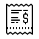

 

  

<h3 align="center">Tip Calculator App</h3>

  

    App built with JavaScript.
     
     
    <a href="https://incredible-legendary-bite.glitch.me/">View project live on Glitch</a>
  

  
Table of Contents

  <ol>
    <li>
      <a href="#about-the-project">About The Project</a>
      <ul>
        <li><a href="#built-with">Built With</a></li>
      </ul>
    </li>
    <li>
      <a href="#getting-started">Getting Started</a>
    </li>
    <li><a href="#usage">Usage</a></li>
    <li><a href="#contributing">Contributing</a></li>
    <li><a href="#contact">Contact</a></li>
    <li><a href="#acknowledgments">Acknowledgments</a></li>
  </ol>

## About The Project

![Product Name Screen Shot][product-screenshot]

* This game uses buttons to lead user from one page to another.
* To achieve this functionality, I used:
  * addEventListener() on each button
  * when button is clicked then function gets called out
  * inside each function are written specific details via setAttribute and innerHTML
* I had a challenge with video sound, therefore I fixed it by having two separate buttons for sound off and on
* In the future I hope to add one button which turns sound on and off!

(<a href="#readme-top">back to top</a>)

### Built With

* JavaScript

(<a href="#readme-top">back to top</a>)

## Getting Started

right click on `index.html`

then `open with live server`

project should be open in Chrome browser

(<a href="#readme-top">back to top</a>)

## Usage

Useful resources to learn JavaScript:
  * [Resource #1](https://www.w3schools.com/js/)
  * [Resource #2](https://developer.mozilla.org/en-US/docs/Web/JavaScript)

(<a href="#readme-top">back to top</a>)

## Contributing

If you have any suggestions that would make this project better, please send me a message!

(<a href="#readme-top">back to top</a>)

## Contact

Evija Gulbe - [LinkedIn](https://www.linkedin.com/in/evija-gulbe-534673240/)

Project Link: [https://github.com/GulbeEvija/Tip-Calculator-App/](https://github.com/GulbeEvija/Tip-Calculator-App/)

(<a href="#readme-top">back to top</a>)

## Acknowledgments

Project provided by [CanSheCode](https://edu-canshecode.thinkific.com/)

(<a href="#readme-top">back to top</a>)

[product-screenshot]: billPhoto.png
